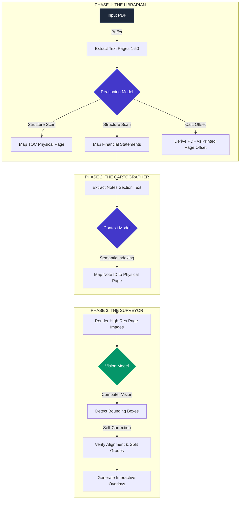

  
  <!-- PROJECT LOGO / HEADER -->
  
  
   
   

  <!-- DYNAMIC REPO STATS -->
  

    
    
    
    
  

  
   
  

    
    
    
  

   
   

  <h1 style="border-bottom: none; font-weight: 800; font-size: 40px; margin-bottom: 0;">UNIVERSAL DOCUMENT NAVIGATOR</h1>
  <h3 style="border-bottom: none; margin-top: 10px; color: #94a3b8;">Advanced Agentic Analysis Interface</h3>

  

    <b>DocNav AI</b> is an enterprise-grade intelligence platform engineered to deconstruct complex financial reports and technical documentation. Leveraging <b>Google Gemini 2.5 & 3.0</b> reasoning models, it autonomously maps document structures, indexes semantic definitions, and performs robotic visual verification to create instant, interactive navigation overlays.
  

   
   

  <!-- TECH STACK -->
  
   
   
  

   
   

---

## 1. SYSTEM ARCHITECTURE

DocNav AI utilizes a privacy-first, client-side agentic architecture. The application state is managed via a high-performance React 19 core, while heavy reasoning tasks are offloaded to the Google GenAI SDK via ephemeral API calls. All file processing, rendering, and modification occur in the browser's memory buffer to ensure data sovereignty.

| Domain | Technology | Role |
| :--- | :--- | :--- |
| **Core Engine** |  | Component Lifecycle & State Orchestration |
| **Logic Layer** |  | Strict Type Safety & Interface Definitions |
| **AI Model** |  | Multimodal Reasoning, Vision, and Context Analysis |
| **Rendering** |  | Canvas Rendering, Text Extraction, & Coordinate Mapping |
| **UI System** |  | Utility-First Design System & Animations |

---

## 2. AGENTIC WORKFLOW

The application follows a strict tri-phase analysis pipeline. This ensures high accuracy by separating structure mapping from content indexing, utilizing specific "Agents" for each task.

---

## 3. ENTERPRISE FEATURES

### 

*   **Local Execution**: PDF files are processed entirely in the browser's memory. No document data is ever uploaded to intermediate servers, ensuring compliance with data privacy standards.
*   **Secure Credential Management**: API keys are stored using encryption in the browser's LocalStorage and injected only at runtime.

### 

*   **Batch Processing**: Multi-threaded analysis queue allows for simultaneous processing of multiple complex reports.
*   **Long-Context Architecture**: Utilizes Gemini's 1M+ token window to process entire sections at once, eliminating the need for vector databases (RAG) and reducing hallucination.

### 

*   **Precision Detection**: The AI outputs normalized 2D bounding boxes (0-1000 scale) for clickable elements on the canvas.
*   **Visual Feedback Loop**: The system renders debug snapshots with drawn boxes and asks the model to verify its own accuracy before committing changes to the UI.

---

## 4. REPOSITORY ANALYTICS

 <a href="https://star-history.com/#IRedDragonICY/docnavai&Date">
  <picture>
    <source media="(prefers-color-scheme: dark)" srcset="https://api.star-history.com/svg?repos=IRedDragonICY/docnavai&type=Date&theme=dark" />
    <source media="(prefers-color-scheme: light)" srcset="https://api.star-history.com/svg?repos=IRedDragonICY/docnavai&type=Date" />
    
  </picture>
 </a>

 

    

---

## 5. LICENSE

    

 

Copyright © 2024 **IRedDragonICY**.
 
Distributed under the **MIT License**. See `LICENSE` for more information.

 
 

  

